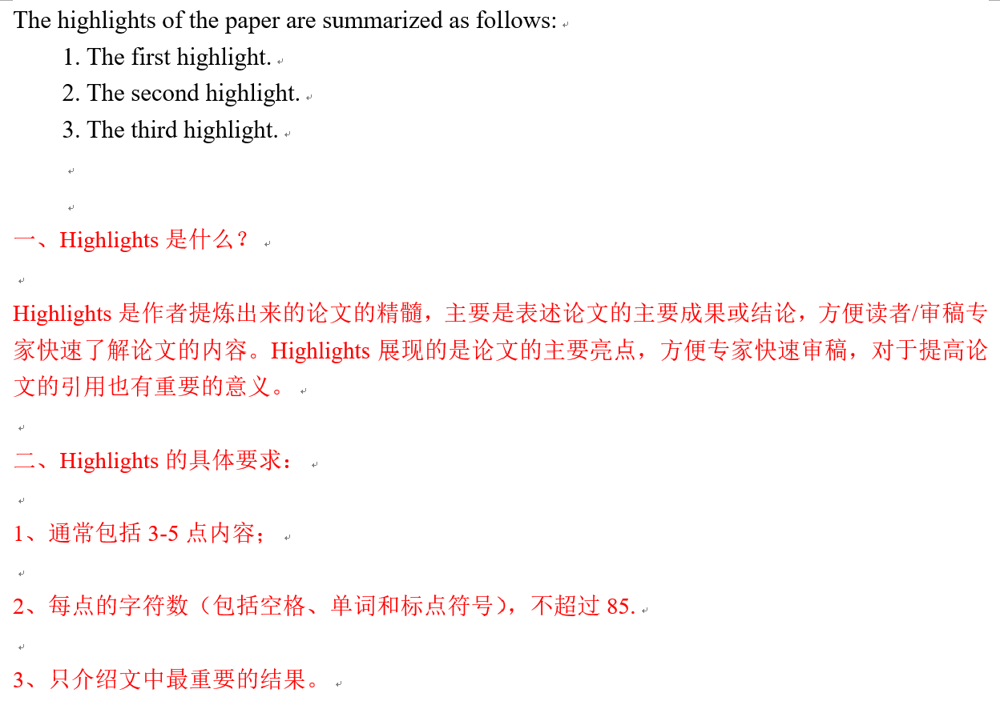

# 目录
## First Submit 期刊投稿材料模板
- [Author Agrement](#author-agrement)
- [Cover Letter](#cover-letter)
- [Credit Author Statement](#credit-author-statement)
- [Declaration of Interests](#declaration-of-interests)
- [Highlights](#highlights)

## Revision 回复审稿人模板
- [Response to Reviewers](#response-to-reviewers)

# 文件组织
```
├── Journal_Submit_Template
    ├── First Submit                              
    │   ├── Author Agrement.docx 
    │   ├── Cover Letter.docx 
    │   ├── Credit Author Statement.docx 
    │   ├── Declaration of Interests.docx 
    │   └── Highlights.docx 
    ├── Revision                              
    │   └── Response to Reviewers.docx
    └── README.md      
```

# 获取方式


## Author Agrement


## Cover Letter


## Credit Author Statement


## Declaration of Interests


## Highlights


## Response to Reviewers

### 总体感谢和相关介绍


### 回复审稿主体


### 万能回复审稿人语句
